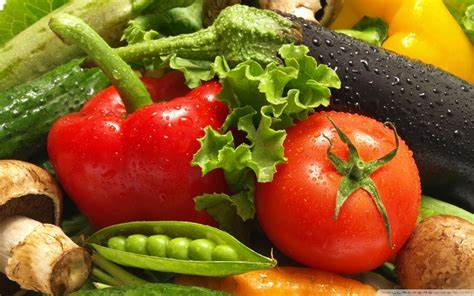

# 🍳 AI Cooking Recipe Assistant

An AI-powered web application that uses computer vision (YOLO) to detect fruits and vegetables from images and recommends curated recipes based on what's available in your kitchen.



---

## ✨ Features

- **Object Detection with YOLOv8**: Automatically identifies produce and ingredients from uploaded images.
- **Recipe Recommendation Engine**: Matches detected items against an extensive recipe database, calculating match scores and listing any missing ingredients.
- **Modern UI / UX**:
  - Drag-and-drop image upload with real-time preview.
  - Interactive visual scanning laser animation during inference.
  - Tag chips with emojis for detected produce.
  - Responsive recipe cards with match percentage meters.
  - One-click sample test images.
- **Clean Architecture**: Organized structure separating production code from experimental prototypes and sample assets.

---

## 📁 Project Structure

```text
ai cooking/
│
├── app.py                     # Main Flask web application & YOLO inference engine
├── index.html                 # Frontend user interface
├── styles.css                 # Modern styling & animations
├── requirements.txt           # Python dependencies
├── yolosaved_bestdataset_2_epoch25.pt  # Trained YOLO model weights
│
├── samples/                   # Sample images for testing
│   ├── OIP.jpeg
│   └── OIP (1).jpeg
│
├── archive/                   # Archived experimental scripts & legacy prototypes
│   ├── app1.py
│   ├── app2.py
│   ├── app3.py
│   └── app5.py
│
├── notebooks/                 # Model training notebooks
│   └── YOLO_Training_Code.ipynb
│
├── .env.example               # Template for environment variables
└── .gitignore                 # Git ignore rules for virtual environments & secrets
```

---

## 🚀 Quick Start

### 1. Clone & Setup Environment

Ensure you have **Python 3.10+** installed:

```bash
# Clone the repository
git clone <your-repository-url>
cd "ai cooking"

# Create and activate a virtual environment
python -m venv venv

# Windows:
.\venv\Scripts\activate
# Linux / macOS:
source venv/bin/activate
```

### 2. Install Dependencies

```bash
pip install -r requirements.txt
```

### 3. Run the Application

```bash
python app.py
```

The application will start locally at:
👉 **[http://127.0.0.1:5000](http://127.0.0.1:5000)**

---

## 🛠️ API Endpoints

| Method | Endpoint | Description |
|---|---|---|
| `GET` | `/` | Serves the web application interface |
| `GET` | `/styles.css` | Serves application stylesheet |
| `GET` | `/samples/<filename>` | Serves sample test images |
| `POST` | `/upload` | Upload image file (`image` form-data) for detection & recipes |

### Sample Response (`/upload`):

```json
{
  "detectedItems": ["carrot", "onion", "potato"],
  "recipeSuggestions": "...",
  "recipes": [
    {
      "name": "Vegetable Soup",
      "score": 60,
      "matching_ingredients": 3,
      "total_ingredients": 5,
      "matched": ["carrot", "potato", "onion"],
      "missing": ["cabbage", "tomato"]
    }
  ],
  "tip": "Tip: Leftover vegetables are perfect for making soup or stock."
}
```

---

## 🔒 Security Best Practices

- Do not commit your `.env` file or API keys to version control.
- An `.env.example` file is provided for reference.
